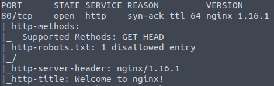
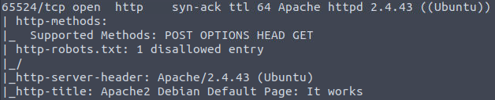

# [EasyPeasy Room](https://tryhackme.com/room/easypeasyctf)

## Introduction
The EasyPeasy Room is an "easy" rated CTF room on TryHack that aims to give beginners in Cybersecurity a way to apply the tools that they've learned i.e. nmap, Gobuster. in a more practical scenario. In this document, I will explain the steps I take as I go through this room. I have started this room on July 2nd of 2023 and I will continue to detail my steps as I go further through the room.

## Write-Up
This section details the steps I've taken to complete this CTF.

### Task 1: Enumeration through Nmap
#### Step 1: Nmap Scan
To start off, I decided to go with an nmap scan to enumerate the deployed machine. I ran this command on the AttackBox:   
`nmap -vv -T5 -A -p- MACHINE_IP`  
The results of the scan are below.  

#### Nmap Command Breakdown
If you're not interested in my breakdown of what the flags/switches/options on the nmap command do, you can skip by clicking [here](https://github.com/RawBoeuf/thm-ctf-writeups/edit/main/EasyPeasy.md#results-analysisanswering-the-task-questions).

First on the board is the `-vv` switch. (I will be using "switch" from now on to not confuse it with the CTF's flags/objectives.)  
This switch enables verbosity level 2. Another similar switch is `-v` this switch increases the verbosity by one level. Verbosity level 2 just means that nmap will provide you with more output. It's especially nice when you can see nmap report the ports as it discovers them although if you want more detailed information such as OS detection, you have to wait for the scan to finish. I just use this in every nmap scan because it's a good habit to have. It is also what is recommended in TryHackMe's introduction room to nmap.  

Next, we have the `-T5` switch. This switch determines the timing of the nmap scan or how fast the connection is. Currently, we are targeting a very insecure machine so there's no need to worry about IPS or IDS so I just went with T5 for the fastest results. But, in general, the manual page of nmap recommends you use -T4 on your nmap scans as T5 is a very aggressive setting.

Moving to the `-A` switch. This switch enables aggressive scan options. According to the [nmap man page](https://linux.die.net/man/1/nmap), this option enables OS detection `-O`, version scanning `-sV`, script scanning `-sC`, and traceroute `--traceroute`.

#### Results Analysis/Answering The Task Questions
**Question 1: How many ports are open?**  

If we take a look at the nmap scan results [above](https://github.com/RawBoeuf/thm-ctf-writeups/edit/main/EasyPeasy.md#step-1-nmap-scan).   
We can find that ports 80, 6498, and 65524 are open. Thus, the answer to this question is 3.  

**Answer: 3**  

**Question 2: What is the version of nginx?**  
For your convenience, I have put the relevant section of the nmap scan below.  
   
We can see that port 80 is open on the target and that it is hosting nginx version 1.16.1. Therefore, the version of nginx is 1.16.1.  

**Answer: 1.16.1**

**Question 3: What is running on the highest port?**  
The highest port discovered from the nmap scan is 65524, so let's take a look at what nmap found.  
  
Looks like nmap found port 65524 to be hosting an apache http server instance. Therefore, we have our answer.  

**Answer: apache**  

### Task 2: Compromising the machine
#### Step 1: Gobuster Directory Enumeration
